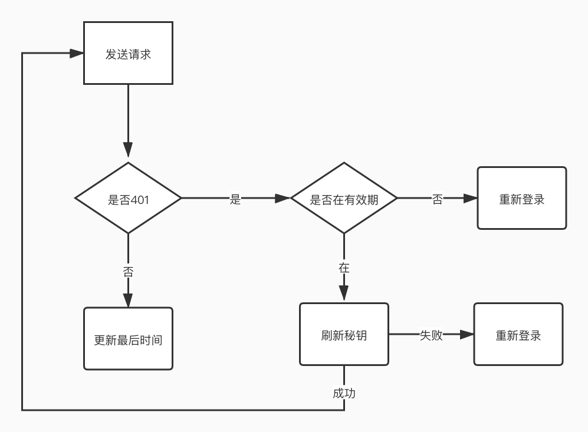

# 滑动授权


```js
// 保质期
export const expireTime = 10 // 分钟
// 最后更新时间
const lastUpdateTime = new  Date()
// 有效期
const expirationDate = lastUpdateTime + expireTime
```

在每个发送给后台的请求，如果出现401 错误， 拦截， 
判断是否在有效期时间内，如果在有效期内， 利用刷新秘钥获取最新的access 秘钥然后重新请求
如果不在有效期内，打开登录页面， 要求用户重新登录

**什么时候更新最后更新时间?**

共两个地方:
1. 路由守卫，
当用户点击切换菜单时，先判断点击的时间减去上次更新的时间是否超出过期时间， 如果已经超出不更新时间，在有效期内更新
2. 发送请求时，验证通过（非401），更新最后更新时间，如果出现401，且在有效期内，刷新秘钥，同时更新刷新时间。
不在有效期， 重新登录。

#### 预期效果
用户在页面持续操作，中间间隔时间不超过保质期， 都是有登录状态，除非刷新秘钥也到期了。
持续操作包括： 发送请求和点击导航栏
点击导航栏的操作并不会实时请求后端判断权限，（权限相关的角色已经被缓存，）
所以极端情况会出现， 用户一直点击导航栏， 则一直不退出登录的状态，但发送请求给后端的时候，
如果超过秘钥刷新时间还是会重新登录

